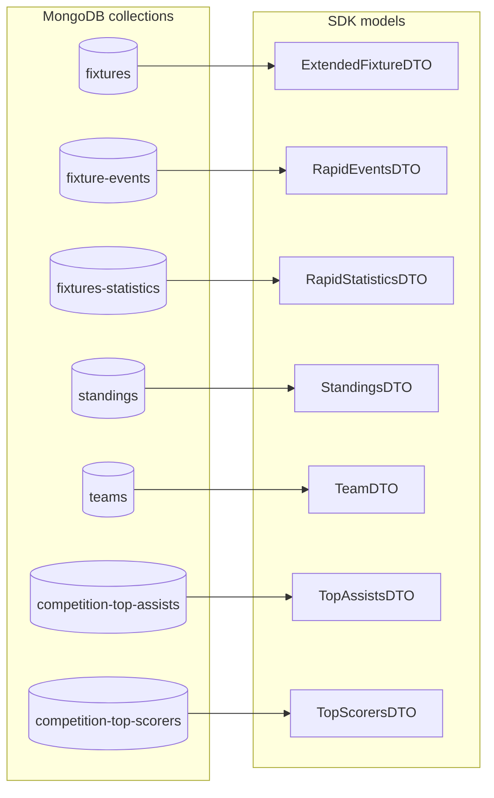

# reelscore-sdk

OpenAPI contracts, generated TypeScript models, shared helpers and constants.
The SDK owns all contracts previously declared in reelscore's `lib/models`.

## Structure

`openapi/reelscore.openapi.json` is the source entry point. It references domain
files for common responses, competitions, teams, coaches, players, standings,
fixtures, fixture status, events, statistics, analyses, evaluations, search,
provider responses, live updates and week data. Each definition has one owner.
Fixture projections reference the common team and competition definitions.

- `openapi/reelscore.bundled.openapi.json`: generated standalone OpenAPI 3.1
  document for tools that prefer one file, including future Swift generators.
- `src/generated/`: generated TypeScript contracts, named aliases and prediction
  constants. Edit the source schemas and regenerate; do not edit generated files.
- `src/models/`: public type entry point.
- `src/shared/constants/`: competition codes, fixture status groups and realtime
  event names. Existing values and array types are preserved.
- `src/shared/helpers/`: date and event calculations.
- `scripts/`: domain reference resolution, generation and ESM/CommonJS builds.
- `tests/`: schema payload validation, consumer type contracts, date behavior and
  package entry-point compatibility.

The pre-existing `openai/examples/` placeholders are preserved and are not used
by generation. The schema directory is `openapi/`.

## Model Graph

This diagram is generated from the Reelscore API's Mongoose collection models and
their shared SDK model imports. The workflow refreshes it on pushes to `main`.

<!-- model-graph:start -->



<!-- model-graph:end -->

## Development

```sh
npm ci
npm run generate
npm run check:generated
npm run lint
npm test
npm pack
```

`npm test` builds the package, checks consumer types and runs behavior tests.
`npm pack` verifies generated files, lints and tests before creating the archive.
The local pilot remains private; no registry publishing is configured.

```ts
import type {
  CompetitionDTO,
  TeamDTO,
  ExtendedFixtureDTO,
} from 'reelscore-sdk/models';
import { CompetitionCode, REALTIME_EVENT } from 'reelscore-sdk/constants';
import { formatFixtureTime, timeTotal } from 'reelscore-sdk/helpers';
```

reelscore uses its `@reelscore-sdk/*` aliases for these package entry points.
Models are imported directly; local compatibility re-exports are not required.

## Contract preservation

The migration follows reelscore's existing declarations, including required and
nullable fields, mixed string/number IDs, Unix seconds, `qoute`, provider spelling
such as `appearences` and `commited`, open string status groups, nullable standings
form/description and the existing single-entry `TeamCoachDTO.career` tuple.
No runtime parsers, field renaming or additional application constraints are added.

OpenAPI describes `Date` fields as serialized date-time strings. The
`x-typescript-type: Date` marker preserves existing TypeScript `Date` declarations
through the generator's [documented transform API](https://openapi-ts.dev/node).
This generates types only; it does not parse incoming JSON into Date instances.
Unmarked existing strings remain strings.

OpenAPI has no TypeScript payload generics. The operation and provider envelopes
use `x-typescript-generic-array` to preserve `OperationResponse<T>` and
`RapidDTO<T>` in generated TypeScript aliases. Concrete schemas inline their
payload types for validation and other languages. Numeric-key records similarly
retain their TypeScript key type with `x-typescript-key-type`.

## Controller follow-up

The separately maintained reelscore-controller has been compared but is not
migrated by this change. Its event contract differs: extra time and assist values
are non-null, `EventTeam` has no `goals`, and substitution details use brackets.
`FixtureLeague.standings` is required there; standings form and description are
non-null. Coach declarations still use boxed `String`/`Number` types whereas
reelscore uses primitives. These differences require a reviewed controller
migration and persisted-payload validation.

Controller-only database, cron, lineup and provider models remain in that
repository. The controller has additional provider models and different file
organization, so replacing its entire model tree automatically is inappropriate.

## Swift models

The package exports the generated standalone document as `reelscore-sdk/openapi`.
Source entry points and individual domain files are also available under
`reelscore-sdk/openapi/<domain>`. A pinned Swift generator can consume the bundled
JSON from a versioned checkout or an extracted npm artifact.

Verify Swift decoding against shared JSON payloads, especially optional versus
nullable values, mixed string/number IDs, Date serialization and Unix seconds.
TypeScript helpers do not become Swift implementations through model generation.
Swift generation and integration remain a separate step.

Competition IDs, URL slugs, season rules and round histories are shared through
`reelscore-sdk/constants`; competition, season and round helpers are exposed
through `reelscore-sdk/helpers`. These sources matched the controller when
migrated. Competition display labels are exported as `COMPETITION_LABEL`, preserving
reelscore’s existing names. The controller currently has different labels for
some international competitions and will need to decide which names to adopt. The controller has not yet been switched to these SDK exports.
